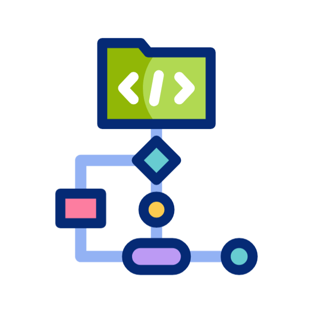

<h3 align="center">
DevOps Engineer | I Build & Deploy SaaS Infrastructure — AWS · Kubernetes · Docker · Terraform · CI/CD
</h3>

  

  
  
  

DevOps Engineer building and operating <b>production AWS infrastructure</b> for SaaS teams.
I ship <b>CI/CD pipelines</b>, <b>Kubernetes deployments</b>, and <b>Infrastructure as Code</b> that cut deployment
time from days to hours, and keep systems running when things get hard.

  
  
  
  
  
  

---

### 🚀 What I Actually Deliver

- **CI/CD pipelines** using GitHub Actions and Jenkins — same-day automated releases, 70% less manual deployment work
- **AWS infrastructure** provisioned with Terraform (IaC) — EC2, EKS, ECS, ECR, S3, VPC, IAM — zero configuration drift
- **Kubernetes deployments** on EKS with rolling updates, health checks, and automatic rollback
- **Docker containerization** — identical environments from dev to staging to production
- **Monitoring & observability** — centralized logging, incident detection before users notice
- **Infrastructure security** — IAM least-privilege, VPC segmentation, secrets management
- **Linux server administration** — configuration management, hardening, automation scripts in Bash and Python

---

### 🧰 Languages & Tools

  

---

### 🏆 Highlights

- **Best Final Year Project 2025 — EduQual UK** · Built a brain-inspired AI system using SpiNNaker neuromorphic hardware, TensorFlow, and Kubernetes
- **20 KCNA Labs completed** · Kubernetes and Cloud Native Associate hands-on lab track
- **Production-grade DevOps** at Al Nafi Cloud — CI/CD, Kubernetes, Terraform, AWS at scale

---

### 📌 Featured Projects

- 🔧 **Flask App on EKS** — Dockerized Python app deployed on AWS EKS with GitHub Actions CI/CD — zero-downtime deploys on every push
- 📊 **Linux Monitoring Tool** — Bash-based disk usage agent persisted to MySQL, deployable via Docker or Kubernetes
- ☁️ **AWS Infrastructure with Terraform** — Repeatable multi-environment IaC setup across dev, staging, and production

---

### 🤝 Open To

- Remote **DevOps Engineer** roles at SaaS companies
- Freelance **cloud infrastructure** and **CI/CD** projects
- Collaborations with developers who need someone to **deploy and scale** what they build

📫 **mohammadhammad.tech@gmail.com**
🔗 **[linkedin.com/in/mhammadtech](https://www.linkedin.com/in/mhammadtech/)**
🌍 **Karachi, Pakistan · Available Remote · UTC+5**

> *Code gets written. Infrastructure gets it shipped. I do the second part.*

  
    
  
  
    
  
  

 

  

